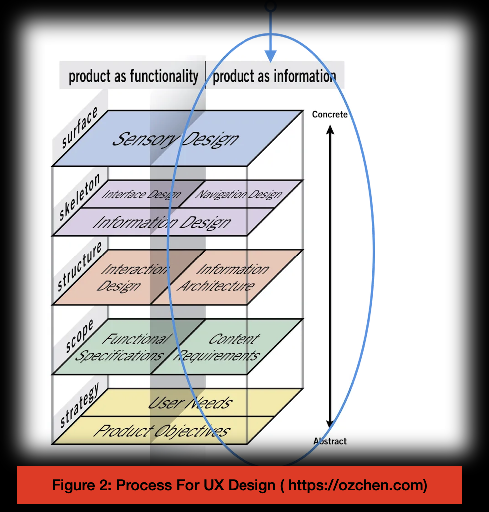
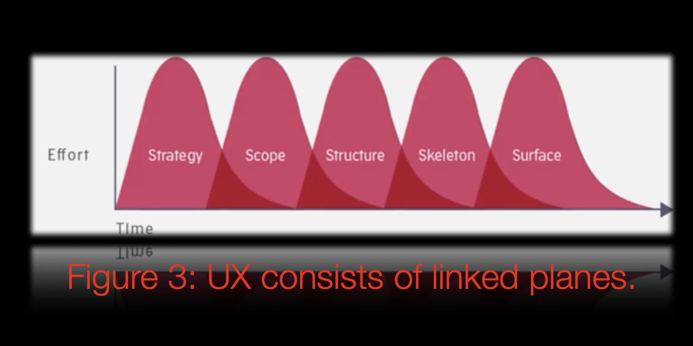
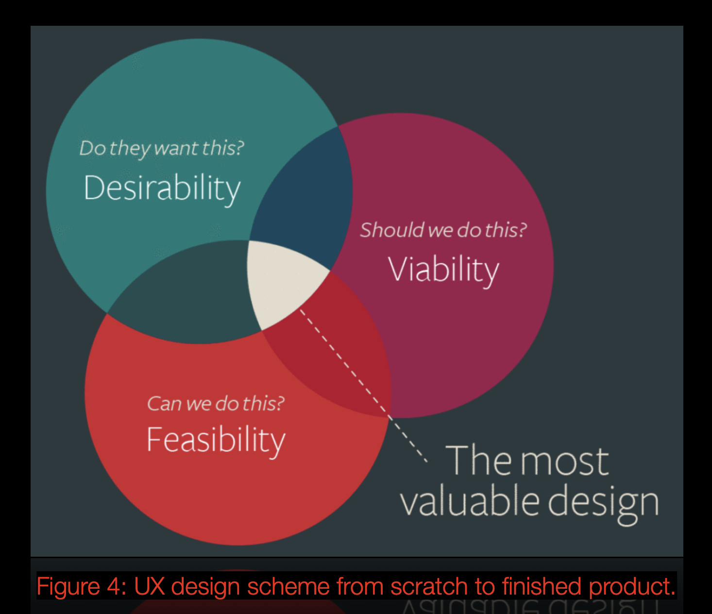
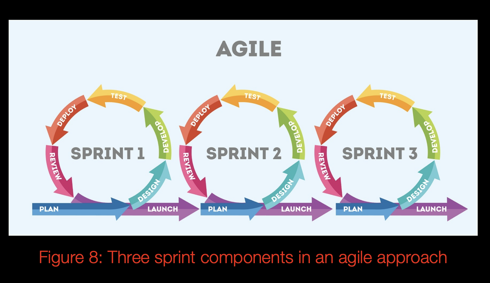
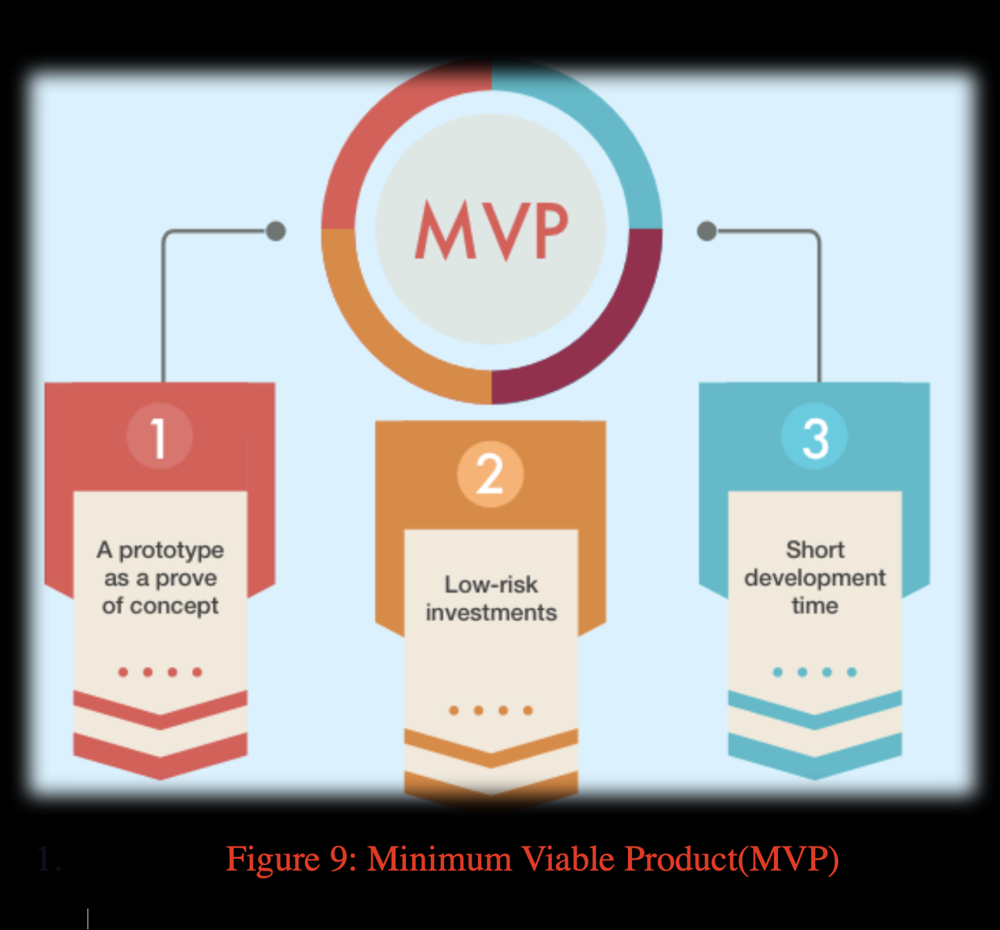
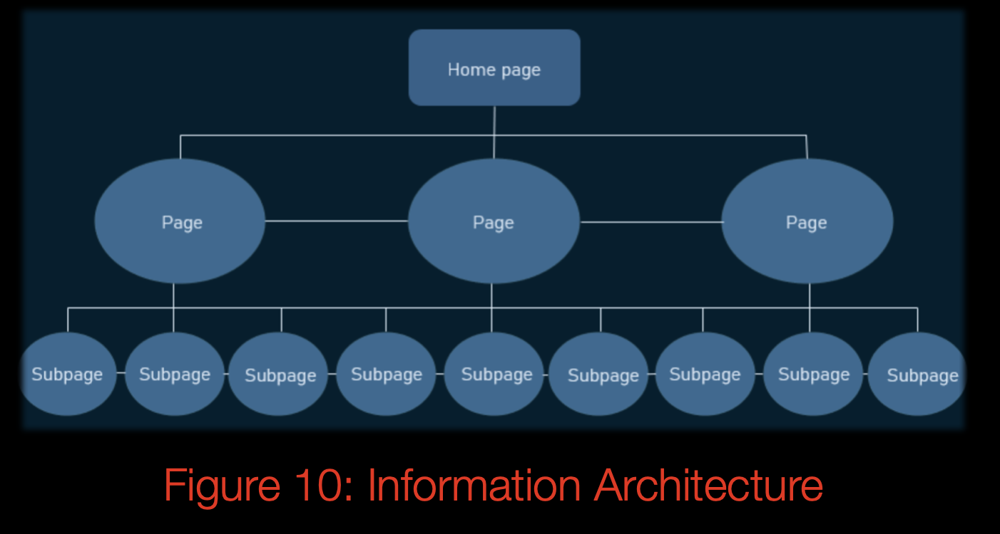

<h1 align="center">FUN GYM - WEBSITE      </h1>

                                      

## ABSTRACT 

I am impressed with your interest in reading the [Fun Gym](https://amir-rastkhadiv.github.io/fun-gym/) website's README file. I am pleased to announce that I will present the User-Centric Frontend Development Milestone Project-1 for Code Institute's Leading Technologies HTML5 and CSS3 course. 

I promise to convey everything that I know. Ask me anything! I welcome ideas, suggestions, feedback, and the occasional rant.

If you need to contact me, you can visit the Fun Gym [website](https://amir-rastkhadiv.github.io/fun-gym/). Or submit an issue on this [repository](https://github.com/Amir-Rastkhadiv/fun-gym). Please do!


## INTRODUCTION 

Fun Gym is a responsive, accessible, and easy-to-understand static website designed to serve gym members and potential members who are curious about the gym's procedures. It aims to connect people to the gym by providing them with the best possible experience.

A general goal is to keep our community motivated to exercise frequently in the UK. Trainers, professionals, students looking for assistance, local councils, and charities supporting the disabled and vulnerable can benefit from the website. Further, it will help families with children and companies that value their employees by showing them when and where they must join to get the most out of it.

As a final point, the developer/owner has combined design and technology to create a terrific website by applying User Experience Design (UXD). Also, a valued website inevitably comes through a user-centred design (UCD) based upon principles, standards, and professional advice provided by the South Devon University Centre College and the Code Institute.

[Have Fun Gym just here!](https://amir-rastkhadiv.github.io/fun-gym/) 

Enjoy it and happy, healthy and wealthy fit coding activity!


 


 


 
 ## Figure-1
 ---

 ---

 
 ## TABLE OF CONTENTS:

- [ABSTRACT](#ABSTRACT)                                          
- [INTRODUCRION](#INTRODUCTION)
- [INTERLUDE](#INTERLUDE) 
  * [TOOLKITS](#TOOLKITS)
  * [WEB DEVELOPMENT OF THE MODERN ERA](#WEB-DEVELOPMENT-OF-THE-MODERN-ERA)
  * [A WEBPAGE? WHAT IS A WEBSITE? HOW ABOUT A GOOD ONE?](#A-WEBPAGE-WHAT-IS-A-WEBSITE-HOW-ABOUT-A-GOOD-ONE)
  * [TERMINOLOGY](#TERMINOLOGY)
- [USER EXPERIENCE (UX)](#user-experience-ux)
  * [GETTING STARTED](#GETTING-STARTED)
  * [WHAT EXACTLY IS USER EXPERIENCE?](#WHAT-EXACTLY-IS-USER-EXPERIENCE)
  * [STRATEGY OVERVIEW (DESIGN AND BUSINESS)](#STRATEGY-OVERVIEW-DESIGN-AND-BUSINESS))
  * [WHAT IS THE UX SYSTEM IS USED FOR?](#WHAT-IS-THE-UX-SYSTEM-IS-USED-FOR)
  * [WHAT IS THIS PRODUCT?](#WHAT-IS-THIS-PRODUCT)
  * [WHO ARE PROJECT USERS?](#WHO-ARE-PROJECT-USERS)
  * [WHO IS THE TARGET AUDIENCE FOR GYMS?](#WHO-IS-THE-TARGET-AUDIENCE-FOR-GYMS)
  * [WHAT ARE YOU TRYING TO ACCOMPLISH?](#WHAT-ARE-YOU-TRYING-TO-ACCOMPLISH)
  * [WHAT TIPS DO YOU HAVE FOR NAMING A GYM PROJECT?](#WHAT-TIPS-DO-YOU-HAVE-FOR-NAMING-A-GYM-PROJECT) 
  * [USER STORIES](#USER-STORIES)
  * [SCOPE OVERVIEW FUNCTIONAL SPECIFICATIONS AND CONTENT REQUIREMENTS](#SCOPE-OVERVIEW-FUNCTIONAL-SPECIFICATIONS-AND-CONTENT-REQUIREMENTS)
  * [STRUCTURE PLANE OVERVIEW](#STRUCTURE-PLANE-OVERVIEW)
  * [(DESIGN) SKELETON PLANE ](#DESIGN-SKELETON-PLANE)
  * [LAYOUTS](#WIREFRAMES)
    * [PEN AND PAPER SKETCHES](#PEN-AND-PAPER-SKETCHES)
    * [WIREFRAMES](#WIREFRAMES)
  * [SURFACE PLANE](#SURFACE-PLANE)
- [USER JOURNEY](#USER-JOURNEY)
- [FEATURES](#FEATURES)
- [TECHNOLOGIES-USED](#TECHNOLOGIES-USED)
  * [LANGUAGES USED](#LANGUAGES-USED)
  * [FRAMEWORKS,LIBRARIES & PROGRAMS USED](#FRAMEWORKS,-LIBRARIES-&-PROGRAMS-USED)
- [TESTING](#TESTING)
  * [RESULTS OF TESTS](#RESULTS-OF-TESTS)
- [DEPLOYMENT](#DEPLOYMENT)
  * [GITHUB PAGES](#GITHUB-PAGES)
  * [FORKING THE GITHUB REPOSITORY](#FORKING-THE-GITHUB-REPOSITORY])
  * [MAKING A LOCAL CLONE](#MAKING-A-LOCAL-CLONE)
- [CREDITS](#CREDITS)
- [CONTENT](#CONTENT)
- [ACKNOWLEGEMENTS](#ACKNOWLEGEMENTS)

---

---

  ## TABLE OF FIGURES:
* [Figure-1](/readme/readme-figures/fig-1-mock-ups.png)
* [Figure-2](/readme/readme-figures/fig-2-uxd.png)
* [Figure-3](/readme/readme-figures/fig-3-ux.png)
* [Figure-4](/readme/readme-figures/fig-4-uxd-s.png)
* [Figure-5](/readme/readme-figures/fig-5-strategy-1.png)
* [Figure-6](/readme/readme-figures/fig-6-strategy-2.png)
* [Figure-7](/readme/readme-figures/fig-7-startegy-3.png)
* [Figure-8](/readme/readme-figures/fig-8-agile-sprints.png)
* [Figure-9](/readme/readme-figures/fig-9-mvp.png)
* [Figure-10](/readme/readme-figures/fig-10-infoart.png)

---
---

## INTERLUDE

 - ### TOOLKITS:
While I will use HTML and CSS to implement a static front-end web application, I will also use many other tools and technologies. 
Click [stream-one](https://amir-rastkhadiv.github.io/my-brilliant-template/index.html) to make things easier.  
 Using the Code Institute module in LMS, I learned to code, gather technical information, and create a robust toolkit. To add further:[TECHNOLOGIES-USED](#TECHNOLOGIES-USED)

 -  ### WEB DEVELOPMENT OF THE MODERN ERA:
 Three parts make up the modern web. Front-end, back-end, and middleware . Each layer includes a set of technologies. Examples include: 
The structure is HTML, the facade is CSS, and the functionality is JavaScript.

Backend languages such as Python, PHP, and Ruby can access databases, web services, and other data sources. A middleware layer relays information between the front and backend. Obtaining responses and requests for HTTP, Accessed APIs,
authentication, routing, and sessions.

Let's only explore HTML and CSS here. Google Chrome also comes with a set of web development tools. I'll use this as my primary tool. I can inspect and analyze a web page (test CSS style changes and debug code).

Please read the following sections to gain further insight.

-  ### A WEBPAGE? WHAT IS A WEBSITE? HOW ABOUT A GOOD ONE? 

This project aims to answer these questions. I used the simple, noble and versatile "WH Questions" technique at all stages. What steps should I take? Which resources can I consult? There are several steps.

Here's what the [Code Institute](https://codeinstitute.net/blog/makes-good-website/) says about the above question. What do you think? 

[Share your thoughts!](https://amir-rastkhadiv.github.io/fun-gym/)  


-  ### TERMINOLOGY:
   -  #### UXD
   User experience refers to how something affects a person.
This discipline ensures that a product works is simple, intuitive, and enjoyable to use.
Embedding user experience strategies at the beginning of the development process is essential. UX is all about ensuring "yes" at all times.

   -  #### UCD
   By using user-centered design, we can achieve a positive user experience. In fact, user-centered design ensures that your product will be loved by users over and over again.

   -  #### UID
   In human-computer interaction (HCI), a user interface is the interface between humans and machines. In this way, the machine is controlled and operated from the human end, while simultaneously providing information to aid the operator's decision-making.

   - #### WHAT DOES SOFTWARE CRAFTMANSHIP ENTAIL?
   A software craftsman believes that software design is more than just hammering the keyboard until your program works as it should. A good approach is to consider the total cost of ownership of a product, e.g., the costs of developing the software and fixing all the defects and maintaining it for many years to come.

My work on the Fun Gym website has focused on generating positive user experiences by mapping, designing an incredible journey, and arranging details for creating the product, all while interacting with web applications.When you fully understand the framework's intricacies, it's enjoyable to write beautiful, well-factored code along with a deadline.

Love Gym? Thriled to code? What about Coding Gym? 

[Contact Fun Gym Engineer/Architect to Get started!](https://amir-rastkhadiv.github.io/arastkhadiv-portfolio/)

## USER EXPERIENCE (UX)

- ### GETTING STARTED

To begin, let's review the essential What, Who, Which, and Where questions. Visual learners tend to find these simple WH questions easy since you can use visual aids, like a picture or an object, as hints. Then, it is simple to move on to asking "When," "Why," and "How."

[Keep Things on Track by Asking the Right Questions](https://amir-rastkhadiv.github.io/fun-gym/)

- ### WHAT EXACTLY IS USER EXPERIENCE?

In a nutshell, a helpful, usable, and valuable product is user experience(UX). It identifies and describes a product's goals, user interface, and interaction with users to determine its success.

There are five phases in UX: strategy, scope, structure, skeleton, and surface. These include tasks, functionality, and information. Therefore, it would be better to prioritize a specific project goal while simultaneously dealing with data.

Figure 2 illustrates precisely how the process works. 



---
##  Figure-2
---

Click [here](https://ozchen.com/5-planes-content-strategy/) 


for more information. 

- ### WHAT IS THE UX SYSTEM IS USED FOR? 

Using the above design system helps you do two things well: Improve consistency and receive coded patterns that you can quickly implement for the following project.
A UX is composed of connected planes. Planes will exchange information, resulting in a complete product. In this process, flexibility is paramount.




#### <p align="center">Figure-3</p>

Click [here](https://learn.codeinstitute.net/courses/course-v1:codeinstitute+FE+2017_T3/courseware/22905698f3be425d918ebc64c87801b7/9c295bdc5a4048308460e262b14ab7df/?child=first) for more information. 

- ### STRATEGY OVERVIEW (DESIGN AND BUSINESS)

According to Einstein, "If I had an hour to solve a problem, I'd spend 55 minutes thinking about the problem and five minutes thinking about solutions."

Generally, problems are necessary for the accomplishment of any worthwhile task. In wise terms, preparation is a valuable tool in solving problems. 

The task is to define a project by identifying questions and analyzing each issue. All it takes is some questions, some research, and some planning.



##### <p align="center">Figure-4</p>

Divide the project into minor problems and concentre on each of them. Analyze your options by determining the pros and cons of each decision. What is the best time not to repeat a procedure? What is your experience? Where can you find resources in your toolkit that might help?

The following are the most questions used in this project at this stage?
  Q1)What is this product?  

  Q2)   Who are project users? 

  Q3)   Who is the target audience for gyms?

  Q4)   What are you trying to accomplish?

  Q5)   What are first-time audiences expected to see?

  Q6)   What are its most common uses? 

  Q7)   What are the things worth doing?

  Q8)   What is the value of each decision? 

  Q9)   What do users expect to see on their first use?

  Q10) Who else is buliding this? 

  Q11) What are they doing? 

  Q12) What are they missing?

  Q13) what could they do better? 

  Q14)  What makes your project a brand?  

  Q15)  What tech matters?

  Q16)  What experience do you have? 

  Q17)  What action can I take now? 

  Q18)  What are the skills I need to acquire?  

  Q19)  What are the expected deadline and current situations, and how much time can each task likely take?

  Q20)  What would you put off doing? 

  Q21)  What about the contents?

  Q22)  Which content types are attractive to users?

  Q23)  What contents are practical?

  Q24)  What do gym goers do in their routine?

  Q25)  What do gym goers do in their routine?

  Q26)  What is the purpose of using the gym website? Does it offer what I want? 

  Q27)  Why would a user need this? 

  Q28) What are the benefits of staying and returning? 

-------------------------------------------------------------------    <button> [Back To Top](#) </button>-------------------------------------------------


- ### WHAT IS THIS PRODUCT?

Gym Website is the product here. 

- ### WHO ARE PROJECT USERS?
  - ##### Gym Members
  - ##### Member's Family-Friends
  - ##### Gym Prospective Members
  - ##### Experts, specialists, champions
  - ##### Students
  - ##### Potential Employees
  - ##### Staff
  - ##### Management
  - ##### Public Visitors
  - ##### Charities
  - ##### Local Government/Local Council 
  - ##### Our Partners
  - ##### Our Competitors
  - ##### Web Design Team
    - ##### Client: Fun Gym Project
    - ##### UX/UI Developer: Amir Rastkhadivmaosuleh
    - ##### Fellow Cohort: Slack Members
    - ##### Colleauges: 

       ##### 1) Assessment team: University Center South Devon College

       ##### 2) Tuturing/Menoring: Code Institute Team

  - ##### Potential Investors:
     - ##### Fan/Federation
     - ##### Developers
     - ##### Tech Companies 
     - ##### Universities/Colleges/Institutes 
     - ##### Owner: Amir Rastkhadivmasouleh

- ### WHO IS THE TARGET AUDIENCE FOR GYMS?

Segmentation analyses indicate that females are the target audience for gyms. Specifically, Zone Fitness targets women aged 25-40. In health and fitness centres, working-class women enjoy exercising while they relax.

Thus, having a hero image from the target audience would be great. 

- ### WHAT ARE YOU TRYING TO ACCOMPLISH?

  I am trying to achieve the following:
  - Develop a gym enthusiast's website. 
  - Compile an industrial work portfolio.
  - Produce an Academic project template. 
  - Enjoy all aspects and say yes to all challenges.  
  - Learn new skills. 
  - Manage time and deadlines effectively.
  - Comply with all high-level assessment requirements.  

- ### WHAT TIPS DO YOU HAVE FOR NAMING A GYM PROJECT?

  Top tips for branding the gym website:

  - Short and memorable name
  - Unique and different from other local brands 
  - Consistent with the gym's underlying principles
  - Create a strong impression
  - Specific constraints on domain names
  - Clearly define the business
  - Target market
  - Thinking to all users
  - Project directory rules   
  - GitHub Repository/Pages conventions 

  Choosing a name was one of the most challenging decisions I've ever made as a designer, developer, and website owner. I did a lot of research, for example, looking for top brand names, Meta or Facebook, Instagram, Twitter, Apple, Code Institue, Virgin etc. 
  
  Thankfully, there are domain generators, and it's crucial to get a term appearing on search engine results. Also, I considered several other gym competitors before I decided on the current name. Last but not least, I should think of my website users. Do they find it inspiring? And is it easy for them to pronounce? What comes to mind when they hear it? Quite an interesting question to ask developers, parents, etc. 

In conclusion, the website was named Fun Gym. 


-   ### USER STORIES

Fun Gym websites cater to a significant segment of the population. Gym users, local communities, health and fitness professionals, tech companies, universities, research institutions, and colleges, as well as potential business investors.

“When you have a clear vision of your goal, it’s easier to take the first step toward it.” [L.L. Cool J., rapper and actor](https://www.menshealth.com/fitness/a19547200/best-fitness-quotes-of-all-time/)

Hence: 
-   #### First Time Visitor Goals: 

    - If I visit a website, I look for something nearly similar to the market or relevant to the business. Having some uniqueness, though, would be great, as well as something that motivates me to delve deeper into the website. 

    - The first impression can be a welcome message, a nice logo, an affable hero image, whatever catches my eye at first glance. It may offer a great deal/discount/features compared to its competitors.
    
    - First-time visitor, I am looking for a responsive and accesible website providing access to working hours, gym locations, and facilities clasess, by viewing an encouraging photo or content. A memorable experience could motivate me to visit the terms and conditions of membership quickly and easily. 
 
    - The purpose of a first visit to the site is to learn more about the organization and understand the site purpose.

    - For a first-time visitor, I must navigate the site efficiently to find information quickly.

    -  To determine whether a company is reputable, I always look for testimonials when I visit their website for the first time. Also, I want to find their social media links to see how well-known and trusted they are on social media. 

    - I am also looking for a FAQ page. In my opinion, it shows the business's responsibility to assist first-time visitors in learning about the company and feel confident about it. The most valuable service is to answer visitors' common questions outside of working hours. The page wins both ways.  

    - It is important to me to be enthusiastic enough to share it with my community and inform them about it or ask their opinion if they are already aware of it. It may make it easy for me and my family-friends, colleagues, teams  to switch to it and have [Fun Gym](https://amir-rastkhadiv.github.io/fun-gym/) all together. 

    - As a design team, my goal is to develop a front-end web application that reflects the principles of usability, accessibility, and responsiveness-a structured website with the main navigation menu. I am also anticipating three to more pages. As a design team first visitor, I hope the page shows photos/ logo featuring fun, hours, or gym schedule. It would be great if it sounded like a real-world project. The learner has documented a detailed rationale for the real-world application and provided an in-depth description of the project’s execution.

    - I am an investor interested in learning who owns FUN GYM.

    -  As a charity, I expect a donation box or page on the website of the gym.  

    -  I am new to the site as a student, so I am looking for a student membership page. A voluntary page would also be an option. 
    
    - I am looking for a career page as a potential employee, trainer, or professional. 

    - It's an honour to be a partner/federation. There is a need for an event page for public visitors for my organization. 

    - My job is to run a business and be a fan. Even at the beginning, you should advertise something about your business to respect your users and to ensure that they are treated appropriately if you can tell them that the site is under construction. Perhaps it will be just a simple webpage.  

-  #### Returning visitor goals: 

     - As a return visitor, I'm interested in learning about personal trainers, their expertise, and classes in general. 
     - Along with the customer service/client care team, please provide the contact information of the key staff and how to reach each department.
     - Pictures of important events would be helpful. Membership Achievements. If heroes exist, please include them. 

     - Visualizing actual events is essential. Achievement registries If heroes exist, list them. 

     - Updates to the website should be consistent with the previous page. Users will find it too frustrating if the site map is drastically changed. Like my first visit, I expect that it maintains the same valuable features. 

     - I am interested in viewing or downloading the Fun Gym white paper.

     - I want to see advice on how to complete the registration form step by step—something like completed sample forms and a list of requirements before attending in personal information for corresponding address or post box. 
 
     - As a student/parent,  I'm interested in learning about holiday packages. Or any events for half term. 

     -  Designers expect images to be of adequate resolution, so they do not appear pixelated or stretched, and external links open in a new tab when clicked.Implement a website whose purpose is

     - Further aims from the design team's point of view are that developing a website that aims for an easy-to-understand solution is evident to a new user without consulting supporting documentation.Describe the needs and expectations associated with the user stories.

      - As an investor/ocharities/organizations/ public visitors we are looking for the way to book meeting with the managers or the owner for our cooperation. 

      -  Professional visitors/investors/charities/organizations/public visitors are interested in meeting /seating with the managers or the owner for further engagements and potential cooperation. Therefore, we need access to the appropriate contact page. 

      - As an applicant, I expect to see details about the job opportunities and the efficient way to apply. 

    -   #### Frequent User Goals
        1. A memorable experience could motivate me to visit the terms and conditions for extending membership quickly and easily or applying for further services. Thus, I expect it to maintain its value as I join and to keep it super and upper. So, I am interested in giving feedback page. 

        2. It would be great to have a page for membership cancellations or complaints.

        3. The frequent users of the fun gym are eagerly awaiting new features, content, classes, staff, challenging matches, and new branches for engaging further with a fun gym. 

        4.  The design team, web developers, colleagues seek outstanding craftsmanship in all phases of fun gym web development, namely design, development, and implementation. 

    -   #### Owner/Developer/Designer strategy plans  
        I am [Amir Rastkhadivmasouleh](https://amir-rastkhadiv.github.io/arastkhadiv-portfolio/index.html). As you may be aware, I am in charge of design. I deal with Fun Gym web development too. For this project, I am responsible for creating the Fun Gym website that addresses the above expectations and handling any problems to the best of my ability. Furthermore, as an owner, I considered all the presented purposes methodologies, and I have provided the following strategic plans offered here at the time to reflect my view.

        

        #### <p align="center">Figure-5</p>

        

        #### <p align="center">Figure-6</p>
       
        
        
        #### <p align="center">Figure-7</p>


- ### SCOPE OVERVIEW (FUNCTIONAL SPECIFICATIONS AND CONTENT REQUIREMENTS)

Currently, we are trying to align the goals with the strategic objectives and use WH questioning techniques to move slowly forward with the scope of work, but we will need to modify our approach. Why?  

According to [Albert Einstein](https://en.wikipedia.org/wiki/Albert_Einstein), "We cannot solve our problems by using the same reasoning we utilized to produce them."

That depends on requirements, features, and content. 

Here are some examples: 

-  What qualities do we wish to include on the site? 
-  What fun gym users say they need? 
-  Precisely what do they need? 
-  What do they not realize they need?

It was essential to align the website's features with the website's intended purpose. The website's traits fall into two categories, namely content and functionality.

Here is where Agile methodology comes into play. Obtain a clear picture of what is currently available in terms of content and features. Describe what is now known as well as what is unknown. Streamlining the documentation will make a big difference. An agile approach implies committing to small, bite-sized pieces of development that will allow the team to learn as it goes.

Agile sprints are defined based on their duration. 
Often, sprints are short. It is common for sprints to include collaboration and development for a few days. 

To avoid scope creep or to create an ineffectual product, our scope must not be too broad or excessively narrow. Focus on features agreed upon at the strategy level to meet deadlines. 

Voici some examples: 
What do they not realize they need?

- How can gym users have fun at the gym? 
- In terms of thechnology? what about Faviction? 
- What about cookies?
- Is it necessary to add additional languages to our website?

It is possible to consider them if there is enough time and information. It may be necessary to wait for the users' feedback and reflections before deciding. 



<p align="center">Figure-8</p>

"When two forces unite, their efficiency double." [Isaac Newton](https://en.wikipedia.org/wiki/Isaac_Newton) 

To stress Fun Gym positively, let's add a bit of intelligent load. How? 

I recommend the following method for your consideration: 

A Minimum Viable Product (MVP) meets a minimum set of requirements.

Minimum viable products are early product versions that contain just enough features for early users to use them. In my opinion, this is the simplest possible version of Fun Gym that addresses a problem. 

Using this method would be suitable for the page under construction. Performing Initial settings makes it simple to deploy one page, and it'll run the minimum goals responsively, then you can add more pages. Social media integration is then a snap. That's why I implemented it first. The aim is to increase your flexibility while lowering your stiffness with a safety factor by pushing and pulling.   




<p align="center">Figure-9</p>

Figure 9 clearly illustrates the points made earlier. 

Please see the following links for additional information about MVP. 

- [CLEVERROAD](https://www.cleveroad.com/blog/who-benefits-with-an-mvp--minimum-viable-product-as-launching-pad-for-startups)
- [Successful Businesses That Started With MVP Development but Now Are Rocking the World](https://medium.com/keenethics-blog/successful-businesses-that-started-with-mvp-development-but-now-are-rocking-the-world-bb776bb86c54)

- #### Content Requitements 
  - On the Fun Gym website, a user will find:
  -  The information provided an overview of the facility, including a description of the equipment, workout areas, and steam room.
  - Services offered include gym products,  activities and instructors.
Contact and location details
  - Transparency: information about the gym and its members, staff, managers 
Visitors, booking information. 
  - Social links
  - Deals and Promotions
  - Site map 
  - FAQ
  - Links to external sites (partners, charities, local amenities )  
  - Student membership/ seasonal deals on holidays
  - Vacancies /Job opportunities  
  - Membership terms and conditions 
  - Encouragement to join
  - Events/News 
  - Positive Vibes( quotes .images, message etc)


- #### Functionality requirements:

  - Easily navigate the website with an 
  informationhierarchy and categorize contents.
  - Browse the website on different platforms,     accessible to search.

  - With the ease of access
  - Consistency
  - Different types of media with varying sizes are available for user control.   
  - Confirmation: Users’ actions are validated, and they always receive feedback. 
  -  Accessibility with clear guidelines. 
  - Whenever possible, links to further resources. 
  - The virtual presentation of an entire business, including technologies, skills, and complex work applied, including fantastic fun gym's team design, supporters and fans.

  - #### Non-functional requirements:

To what extent does the Fun Gym website adhere to these constraints?

I may need to think about security, environmental impact, and scalability.

[How is the distinction between functional and non-functional requirements essential?](https://reqtest.com/requirements-blog/functional-vs-non-functional-requirements/) 

  - #### Bussines ruless:
There needs to be a set of rules that takes into account the user stories and their interactions with the system as well as what is realistically possible. This requires me  to develop a means of turning these stories into reality. Below are my planned releases:

- #### Releases 
  - Development of Fun Gym's front-end:

     - Release 1: Revealing the name, the website link, and the links to the documentation to your design team in particular colleagues along with a simple comic illustration showing heart as love, fitness and health, and a victory sign as the hope for people as well as a message to keep them awake by showing progress bar with a percentage that fun gym is soon to arrive.  Make sure it is responsive on all devices. 
     - Release 2: Part of website, final logo, background colour, hero image, e.g. navbar and footer. 

     - Release 3: Show off the Static Website/end of front end milestone one development.


  - Future Development: (Out of the scope of milestone project 1)

     - Release 4: Backend Development (After initial assessments)

     - Release 5: Full Stack Development(A few months later, receiving all feedback having all techs and skills on the table.)

 - ### STRUCTURE PLANE OVERVIEW
 
     During this phase, our project structure could be built gradually. Utilizing "WH" questioning techniques in higher levels by asking most of the time How? and Where?

     How do I get to a specific place, for example? Then, where do I go next? So, where do I put this information?

     I used the following questions to shape the Fun Gym structure step by step. In which functionality and content appear:


     -  How will the user navigate through content and features intuitively?

        - In what way will a location be accessible?

        -  How do we proceed?

        - How will categories of information appear? And where will they appear?

        - How are you going to make it intuitive and interactive?

        -  Which structure will we use? Simple or Complex? Linear or Non-Linear? How about something flexible?

     - User interaction: There are five main concerns in interaction design.Therefore, Fun Gym should be consistent, predictable, learnable, visible, and provide clear and intuitive feedback.

        -  How to mitigate the chance of user error? Where do users go? How can they return to the safety page? How could they report it?  

        -  When will users be made aware of system changes? How? 

        -  How will we reveal workflows?

        -  Precisely how will interactivity and functionality be communicated?

        - How will we link content and details? 

        -  Describe how interactive elements in Fun Gym will be structured and acted by users?

     - The distinction should only take place in cases where it can improve things. The consistency and predictability of Fun Gym services.

        -   How to keep conventions as users expect?
        -  How to maintain a consistent colour scheme and theme?
        -   How to ensure transitions, rollovers, and tooltips work smoothly?

        -  How to create compatible imagery? 

    -  Aesthetic, attainable, obtainable:  

         -   Where must every element be easy to use and locate? 
         -   How could Fun Gym fulfil visitors' expectations? 
         - How to convey the path to visitors(page number, indication of where they are)?
         -  How should the users be notified when there is an error or maintenance? How can they obtain additional information? 

     -  Information architecture: 

        - What kind of structure does Fun Gym need? For what reason? How would I apply it?

        - How would you describe the following structures? 
          - Hieriachial tree structures 
          - Nested list 
          - Hub and spoke 
          - Dashboard 

     - How do you feel about Fung Gym's appropriate principles? 

     The Fun Gym application appeals to consumers, educators, businesses, and investors. Depending on the needs of my users, I may need to consider geography, time, and technology. 

     To reflect on all matters relating to this project, the Fun Gym began with a flat page. The page contained a link to social media and information about the project's progress, along with an email address. 

     Figure 10 illustrates the information architecture for releases 2 and 3 and the reliable structure for releases 4 and 5. The 'WH' questions method and search and mapping techniques allowed me to accomplish this. 

     

<p align="center">Figure-10</p>

Fun Gym uses  Co-existing Hierarchies as it is flexible, customised, and meets complex requirements for a professional and educated audience. The navigation will be a hamburger menu for mobile devices to make it mobile-friendly.  

Here is a helpful link I found: 

[How to Create Information Architecture for Web Design?](https://www.altexsoft.com/blog/uxdesign/information-architecture/)

- ### (DESIGN) SKELETON PLANE 

According to figure 2, we are now right under the surface plane. The Skeleton Plane controls the Fun Gym content layout and how content appears on the site, making it possible to communicate with users without stressing entirely about visuals. How? The best way is to create wireframes. What will enable users to use your site?

One step closer to the Fun Gym design, structure planning, such as interaction design and information architecture, is now incorporated into the skeleton plan, focusing on interface and navigation design. The term appears in conjunction with design, but much more. 

In this stage, I meant releases 1 through 3 of the project. I am primarily concerned with the presentation of data to users; I am not concerned with data manipulation or dealing with data at rest. We will discuss these issues in future releases according to the strategic plan. Thus, UI is the primary target for Release 3. According to the majority of users, the interface is everything.  

Generally, when I designed the Fun Gym website, I focused more on the following areas:

  - How can the website capture the audience's attention on the first visit? 

  - What counts as the usefulness of the page? 

  - Contents and their value to users, namely icons, nav bars items, clickable buttons Etc.

  - What could I do to deliver the information when users need it and direct them to where they want it? 

  - Make sure that fun gym web pages are familiar for users by repeating specific spaces across all pages, namely, the navigation bar and footer so that the user will not get surprised and can experience more. 

  - How to make the overall experience more positive?

  - How can we provide optimal features and content usefulness?

  - How can you make navigation easy using colour, lists, and filtering?  

  - What about metaphors? Ensure the navigation bar, tabs, clicking buttons. Design it as unobtrusive as possible, but be honest to the contents, thorough, innovative, and eco-friendly.

  - Are Fun Gym pages can order information properly? Is it necessary to have a map?  

  - How do I design forms? 

  - Keeping forms simple decreases error rates.

  - How intuitively obvious are the shortcuts?

-  ### LAYOUTS

Layouts emerge from the skeleton plane. They are a visible part of the design. 

The developer benefited from paper and penned simple pages for the fun gym design, then created a balsamic wireframe to see how each screen fits into the whole site and how it will look. 

Wireframes and paper sketches helped pace the design determine what links and content are required to meet users' needs. The process gives a better vision of your design. I believe the wireframes are just a way to get started touching the surface plane. 

They are two-dimensional. Colour is not necessary since it cannot precisely represent the design colour. However, I used colours for reminders or even to make their use easier for my eyes wherever I felt needed. 


-  ### PEN AND PAPER SKETCHES

The Fun Gym Project Pen and Paper Sketches can be viewed by following the link below or visiting the  layouts folder in the project repository. 

[pen-paper-sketches](/layouts/pen-paper-sketches/)


-  ### WIREFRAMES
The Fun Gym Project Wireframes can be viewed by following the link below or visiting the  layouts folder in the project repository. 

[wireframes](/layouts/wireframes/)


  Home page  Wireframe - [View](https://amir-rastkhadiv.github.io/fun-gym/
)

   Mobile Wireframe - [View](https://amir-rastkhadiv.github.io/fun-gym/
)

 Contact Us Page Wireframe - [View](https://amir-rastkhadiv.github.io/fun-gym/
)

-  ### SURFACE PLANE

## USER-JOURNEY 

## FEATURES 

-   Responsive on all device sizes

-   Interactive elements

## TECHNOLOGIES-USED

### LANGUAGES USED

-   [HTML5](https://en.wikipedia.org/wiki/HTML5)
-   [CSS3](https://en.wikipedia.org/wiki/Cascading_Style_Sheets)

### FRAMEWORKS,LIBRARIES & PROGRAMS USED

1. [Bootstrap 4.4.1:](https://getbootstrap.com/docs/4.4/getting-started/introduction/)
    - Bootstrap was used to assist with the responsiveness and styling of the website.
1. [Hover.css:](https://ianlunn.github.io/Hover/)
    - Hover.css was used on the Social Media icons in the footer to add the float transition while being hovered over.
1. [Google Fonts:](https://fonts.google.com/)
    - Google fonts were used to import the 'Titillium Web' font into the style.css file which is used on all pages throughout the project.
1. [Font Awesome:](https://fontawesome.com/)
    - Font Awesome was used on all pages throughout the website to add icons for aesthetic and UX purposes.
1. [Git](https://git-scm.com/)
    - Git was used for version control by utilizing the Gitpod terminal to commit to Git and Push to GitHub.
1. [GitHub:](https://github.com/)
    - GitHub is used to store the projects code after being pushed from Git.
1. [Balsamiq:](https://balsamiq.com/)
    - Balsamiq was used to create the [wireframes](https://github.com/) during the design process.

## TESTING

The W3C Markup Validator and W3C CSS Validator Services were used to validate every page of the project to ensure there were no syntax errors in the project.

-   [W3C Markup Validator](https://jigsaw.w3.org/css-validator/#validate_by_input)
-   [W3C CSS Validator](https://jigsaw.w3.org/css-validator/#validate_by_input)

- The developer evaluated the Fun Gym website with a tool called  [WAVE- WEBAIM](https://wave.webaim.org/waverunner).

- To meet the word limits for GitHub commits, meta tags, and so on, the project designer used [EASYWORDCOUNT](https://easywordcount.com/).

### RESULTS OF TESTS

[tests](/tests/)

## DEPLOYMENT

### GITHUB PAGES

The project was deployed to GitHub Pages using the following steps...

1. Log in to GitHub and locate the [GitHub Repository](https://github.com/)
2. At the top of the Repository (not top of page), locate the "Settings" Button on the menu.
    - Alternatively Click [Here](https://raw.githubusercontent.com/) for a GIF demonstrating the process starting from Step 2.
3. Scroll down the Settings page until you locate the "GitHub Pages" Section.
4. Under "Source", click the dropdown called "None" and select "Master Branch".
5. The page will automatically refresh.
6. Scroll back down through the page to locate the now published site [link](https://github.com) in the "GitHub Pages" section.

### FORKING THE GITHUB REPOSITORY

By forking the GitHub Repository we make a copy of the original repository on our GitHub account to view and/or make changes without affecting the original repository by using the following steps...

1. Log in to GitHub and locate the [GitHub Repository](https://github.com/)
2. At the top of the Repository (not top of page) just above the "Settings" Button on the menu, locate the "Fork" Button.
3. You should now have a copy of the original repository in your GitHub account.

### MAKING A LOCAL CLONE

1. Log in to GitHub and locate the [GitHub Repository](https://github.com/)
2. Under the repository name, click "Clone or download".
3. To clone the repository using HTTPS, under "Clone with HTTPS", copy the link.
4. Open Git Bash
5. Change the current working directory to the location where you want the cloned directory to be made.
6. Type `git clone`, and then paste the URL you copied in Step 3.

```
$ git clone https://github.com/YOUR-USERNAME/YOUR-REPOSITORY
```

7. Press Enter. Your local clone will be created.

```
$ git clone https://github.com/YOUR-USERNAME/YOUR-REPOSITORY
> Cloning into `CI-Clone`...
> remote: Counting objects: 10, done.
> remote: Compressing objects: 100% (8/8), done.
> remove: Total 10 (delta 1), reused 10 (delta 1)
> Unpacking objects: 100% (10/10), done.
```

Click [Here](https://help.github.com/en/github/creating-cloning-and-archiving-repositories/cloning-a-repository#cloning-a-repository-to-github-desktop) to retrieve pictures for some of the buttons and more detailed explanations of the above process.

## CREDITS

- In creating the Fun Gym website under construction page, the developer adapted the [Balsamic](https://balsamiq.com) free media icon and mixed it with heart and victory icons for the logo.AAdditionally, the Balsamiq website has ten principles for effective wireframes mentioned on page 2 of the wireframe layouts.

- Scientists and celebrities have been quoted in the document whenever the author felt it was appropriate and inspiring, namely,  Albert Einstein, Isaac Newton, L.L. Cool J. There is a link to the author's Wiki when this sentence appears.   

- ["Am I Responsive"](http://ami.responsivedesign.is/) website was used to make the initial mock-ups shown in Figure-1.

- I took Figure-2 from [Ozchen's website](https://ozchen.com/5-planes-content-strategy/) and modified it for the UX design section. 

- Figure-3 contents are from the [Code Institute](https://learn.codeinstitute.net/courses/course-v1:codeinstitute+FE+2017_T3/courseware/22905698f3be425d918ebc64c87801b7/9c295bdc5a4048308460e262b14ab7df/?child=first). 

- Figure-4: Screenshot with bit change in design by the developer from  ['Crowd Favourite'](https://crowdfavorite.com/the-value-of-balancing-desirability-feasibility-and-viability/) website.

- The image in Figure 8 is from [SolDevelo](https://www.soldevelo.com/blog/is-agile-always-the-best-solution-for-software-development-projects/).

- Figure 9: Screenshot of the Minimum Viable Product (MVP) after the developer slightly changes the design from [CLEVEROAD](https://www.netguru.com/glossary/minimum-viable-product). 

- The stories section includes a quote from the [Men'sHealth](https://www.menshealth.com/fitness/a19547200/best-fitness-quotes-of-all-time/) website.

-  The link in the scope chapter is from the [ReQuest](https://reqtest.com) website. 

- Figure 10 is available on the [altexSoft] website(https://www.altexsoft.com/blog/uxdesign/information-architecture/)

- The hero image is from the [pickwizard](https://pikwizard.com/?q=gym+ball) website.

- The developer took into account accessibility tutorials [w3schools](https://www.w3schools.com/accessibility/index.php) when writing the code.

- Accessibility of social media icons? I found [Saavas](https://savvas.me/accessibility/problem-with-social-icons) website helpful.

- Heading tag structure guides on nomensa [nomensa](https://www.nomensa.com/blog/how-structure-headings-web-accessibility) and the [Code Institute-LMS](https://learn.codeinstitute.net) was impressive.

## CONTENT

-   All content was written by the developer.

## ACKNOWLEGEMENTS

-   Thanks to my family, friends, and siblings who have supported me and my endeavours, I am grateful for their affection and support.

- I am grateful for the fantastic support from my tutor at South Devon University-College.

- My mentor provides continuous professional support and helpful feedback.

- Thank you so much to the Code Institute tutor support staff for all your help.

- The web developer community on Slack is also constructive.

# -----------------------------------------[Back To Top](#) --------------------
